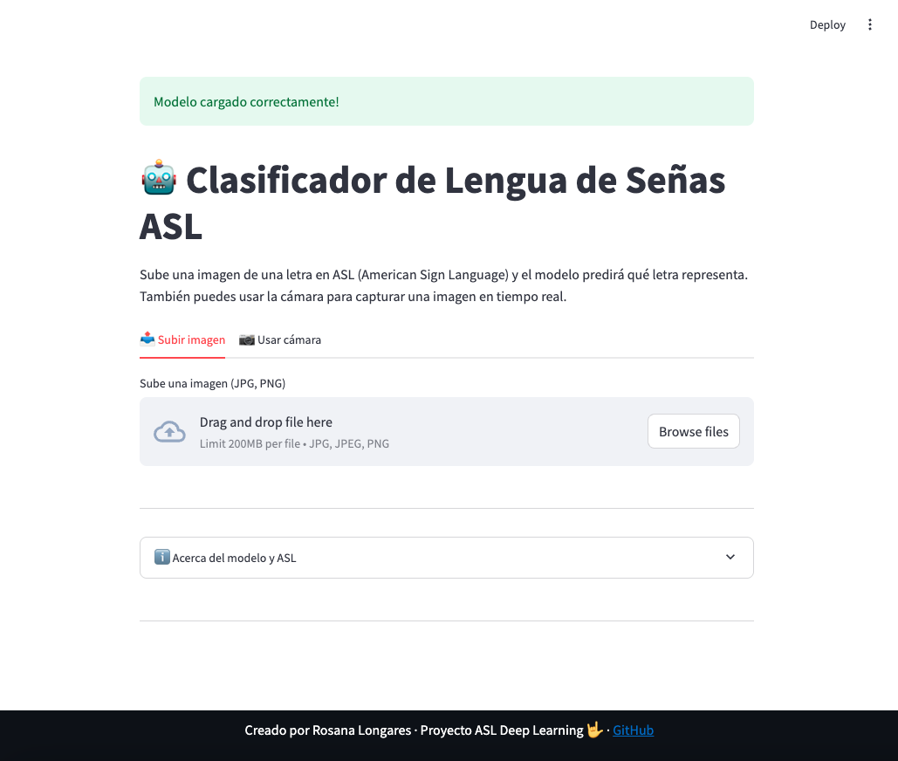
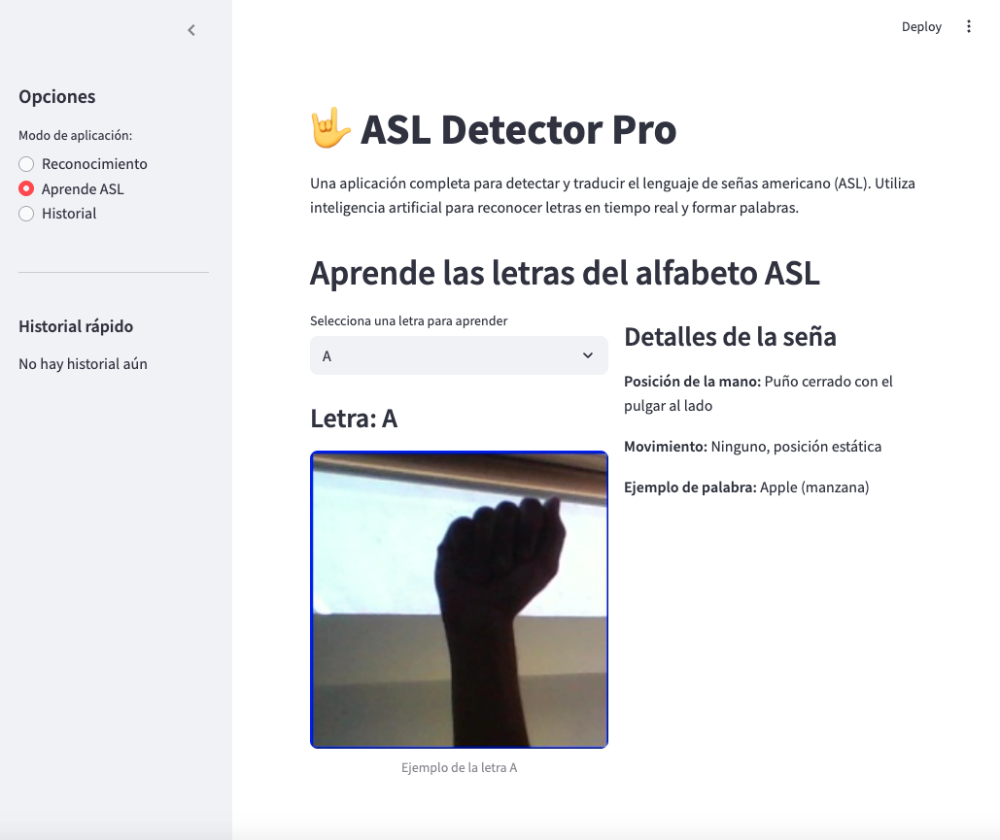
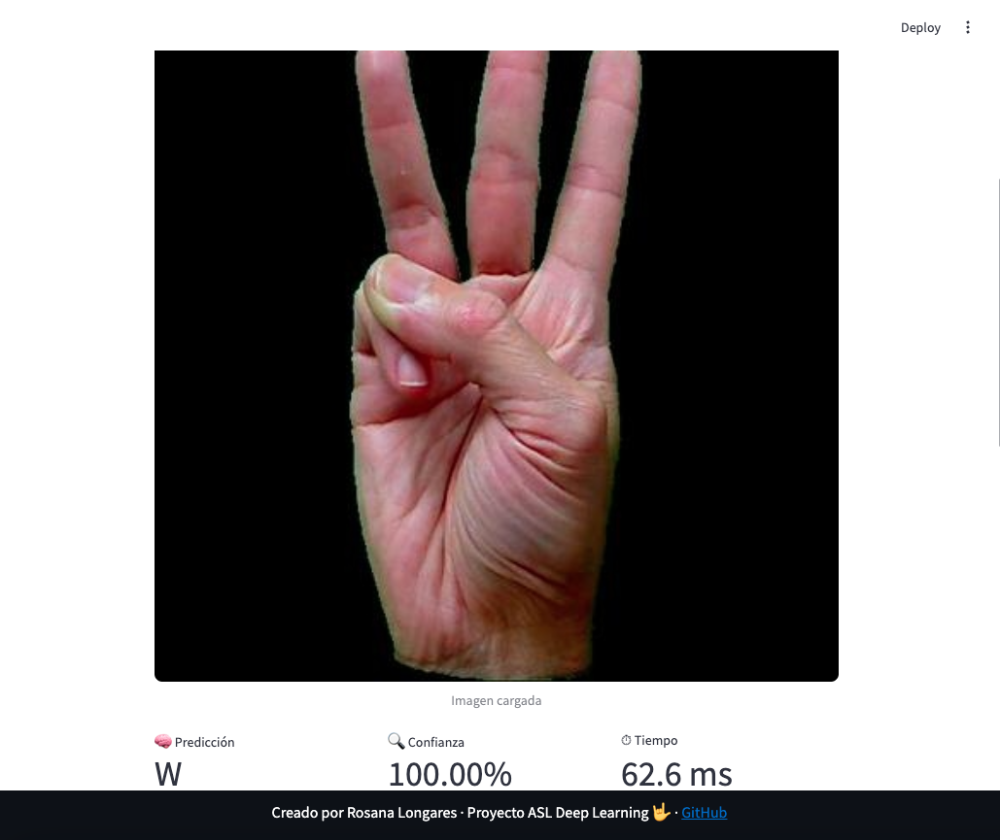

🤟 ASL Detector Pro
Una aplicación completa para detectar y traducir el lenguaje de señas americano (ASL) en tiempo real utilizando inteligencia artificial. La app permite reconocer letras mediante imágenes estáticas o video en vivo, formando palabras a partir de las predicciones realizadas por un modelo entrenado con redes neuronales convolucionales.

  

🧠 ¿Qué hace esta aplicación?
Detecta gestos de la mano correspondientes al alfabeto ASL.
Traduce los gestos a letras del alfabeto.
Forma palabras/frases en base a una historia de predicciones.
Muestra información sobre cómo realizar cada seña.
Permite trabajar con:
Imágenes subidas por el usuario
Captura desde cámara web
Video en tiempo real

📦 Requisitos
Asegúrate de tener instaladas las siguientes librerías:

bash

1
pip install streamlit tensorflow numpy pandas opencv-python pillow av streamlit-webrtc
También necesitas:

Un modelo guardado como asl_model_aug.h5
Un conjunto de imágenes de ejemplo organizadas en carpetas según la letra (asl_alphabet_test/A, asl_alphabet_test/B, etc.)
📁 Estructura del Proyecto

  

American_Sign_Language /
│
├── apptotal.py                 # Código principal de la aplicación
├── asl_model_aug.h5           # Modelo preentrenado de detección ASL
├── asl_alphabet_test/         # Carpeta con imágenes de prueba por letra
│   ├── A/
│   ├── B/
│   └── .../
├── README.md                  # Este archivo
└── requirements.txt           # Archivo con dependencias
🚀 Cómo ejecutar la aplicación
Asegúrate de tener Python 3.x instalado.
Instala las dependencias:
bash

1
pip install -r requirements.txt
Coloca el modelo (asl_model_aug.h5) y las imágenes de prueba en las carpetas correctas.
Ejecuta la aplicación:
bash

  

1
streamlit apptotal.py
Abre el navegador y accede a la interfaz web que se muestra automáticamente.
🎮 Modos de uso
1. Reconocimiento
Sube una imagen o usa la cámara/webcam para detectar una letra ASL.
Se muestra la predicción con su nivel de confianza.
2. Aprende ASL
Selecciona una letra y aprende cómo realizarla:
Posición de la mano
Movimiento requerido
Palabra de ejemplo
3. Historial
Visualiza las letras detectadas en secuencia.
Puedes borrar el historial cuando lo desees.
📷 Notas importantes
El modelo usado debe estar entrenado con datos del dataset ASL, como el disponible en Kaggle: American Sign Language Dataset .
Para mejorar la precisión, asegúrate de tener buena iluminación y fondo claro al usar la webcam.
Esta aplicación no reemplaza herramientas profesionales de accesibilidad, pero puede servir como prototipo funcional.
🛡️ Licencia
Este proyecto está bajo la licencia MIT. Puedes usarlo, modificarlo y distribuirlo libremente.

  

👥 Contacto
¿Tienes dudas o sugerencias?
📧 rosana8longares@gmail.com
🔗 LinkedIn
🔗 GitHub

✅ Recursos recomendados
Dataset ASL en Kaggle
Documentación de Streamlit
TensorFlow Docs
OpenCV Documentation
¡Esperamos que este proyecto te sea útil para el desarrollo de aplicaciones de accesibilidad y comunicación inclusiva!

🤟 ¡Comunicación sin barreras!